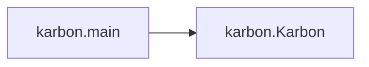

# Key Objects

[_Documentation generated by Documatic_](https://www.documatic.com)

<!---Documatic-section-karbon.main-start--->
## karbon.main

<!---Documatic-section-main-start--->


### Object Calls

* karbon.Karbon

<!---Documatic-block-karbon.main-start--->
<details>
	<summary><code>karbon.main</code> code snippet</summary>

```python
def main():
    app = Karbon()
    app.run()
```
</details>
<!---Documatic-block-karbon.main-end--->
<!---Documatic-section-main-end--->

# #
<!---Documatic-section-karbon.main-end--->

<!---Documatic-section-setup.get_long_description-start--->
## [setup.get_long_description](1-setup.md#setup.get_long_description)

<!---Documatic-section-get_long_description-start--->
<!---Documatic-block-setup.get_long_description-start--->
<details>
	<summary><code>setup.get_long_description</code> code snippet</summary>

```python
def get_long_description():
    readme_md = CURRENT_DIR / 'README.md'
    with open(readme_md, encoding='utf8') as ld_file:
        return ld_file.read()
```
</details>
<!---Documatic-block-setup.get_long_description-end--->
<!---Documatic-section-get_long_description-end--->

# #
<!---Documatic-section-setup.get_long_description-end--->

[_Documentation generated by Documatic_](https://www.documatic.com)